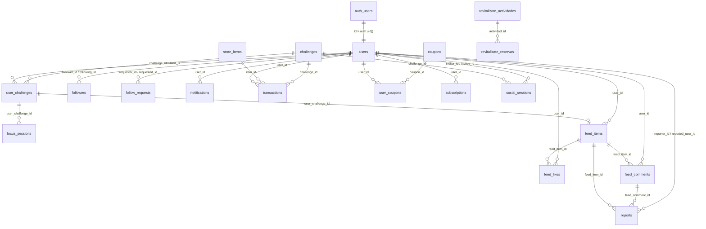

# Esquema de Base de Datos — Calixo PWA

Documentación generada a partir del proyecto Supabase **calixo** (`https://alpdtdumurvyhzmyoapn.supabase.co`).

**Última revisión:** Julio 2026  
**Tablas en `public`:** 22 · **RLS habilitado en todas**

---

## Índice

1. [Visión general](#visión-general)
2. [Diagrama de relaciones](#diagrama-de-relaciones)
3. [Tipos enumerados (ENUM)](#tipos-enumerados-enum)
4. [Tablas por dominio](#tablas-por-dominio)
5. [Funciones y triggers](#funciones-y-triggers)
6. [Políticas RLS](#políticas-rls)
7. [Configuración global (`config`)](#configuración-global-config)
8. [Supabase Storage](#supabase-storage)
9. [Migraciones versionadas](#migraciones-versionadas)
10. [Notas operativas](#notas-operativas)

---

## Visión general

Calixo usa **PostgreSQL** en Supabase con el esquema `public`. La identidad de usuarios vive en `auth.users` (Supabase Auth); el perfil de aplicación está en `public.users` con `id` = `auth.uid()`.

### Dominios funcionales

| Dominio | Tablas | Propósito |
|---------|--------|-----------|
| **Usuarios** | `users` | Perfil, monedas, energía del avatar, premium, admin |
| **Retos** | `challenges`, `user_challenges`, `focus_sessions`, `social_sessions` | Catálogo, progreso, modo focus y retos sociales |
| **Feed social** | `feed_items`, `feed_likes`, `feed_comments`, `feed_banners` | Publicaciones, interacciones y banners promocionales |
| **Social graph** | `followers`, `follow_requests`, `notifications` | Seguimiento, solicitudes y avisos |
| **Economía** | `transactions`, `coupons`, `user_coupons`, `store_items` | Monedas, tienda y cupones |
| **Suscripciones** | `subscriptions` | Premium vía Stripe |
| **Moderación** | `reports` | Reportes de usuarios, posts y comentarios |
| **Sistema** | `config` | Parámetros de negocio en JSON |
| **Legacy / externo** | `contacts`, `revitalizate_actividades`, `revitalizate_reservas` | Newsletter y módulo Revitalízate (sin uso en app actual) |

### Conteo de filas (aprox., al momento de documentar)

| Tabla | Filas |
|-------|------:|
| users | 6 |
| challenges | 5 |
| user_challenges | 22 |
| feed_items | 21 |
| transactions | 22 |
| notifications | 11 |
| contacts | 16 |
| feed_likes | 6 |
| feed_comments | 4 |
| feed_banners | 5 |
| coupons | 3 |
| followers | 2 |
| follow_requests | 2 |
| user_coupons | 2 |
| reports | 1 |
| focus_sessions | 1 |
| store_items, subscriptions, social_sessions, revitalizate_* | 0 |

---

## Diagrama de relaciones

> Las FKs hacia `auth.users` (p. ej. `user_id` en varias tablas) no se muestran explícitamente en el diagrama pero existen a nivel de aplicación vía Supabase Auth.

---

## Tipos enumerados (ENUM)

### `challenge_type`

| Valor | Uso |
|-------|-----|
| `daily` | Reto diario |
| `focus` | Modo focus (timer con sesiones) |
| `social` | Reto entre dos usuarios |

### `challenge_status`

| Valor | Uso |
|-------|-----|
| `pending` | Creado, no iniciado |
| `in_progress` | En curso |
| `completed` | Completado con éxito |
| `failed` | Fallido |
| `finished` | Timer terminado (sistema de confianza, pendiente de reclamar) |
| `claimed` | Recompensa reclamada por el usuario |

### `notification_type`

| Valor | Uso |
|-------|-----|
| `reward` | Recompensa / monedas |
| `social` | Actividad social (seguidores, likes…) |
| `system` | Mensajes del sistema |
| `challenge` | Eventos de retos |

---

## Tablas por dominio

### `users`

Perfil de aplicación vinculado 1:1 con Supabase Auth.

| Columna | Tipo | Null | Default | Descripción |
|---------|------|:----:|---------|-------------|
| `id` | `uuid` | NO | — | PK = `auth.users.id` |
| `display_name` | `text` | NO | — | Nombre visible (**único**) |
| `avatar_energy` | `int4` | NO | `100` | Energía del avatar (0–100) |
| `is_private` | `bool` | NO | `false` | Perfil privado (feed restringido) |
| `is_premium` | `bool` | NO | `false` | Acceso premium |
| `is_admin` | `bool` | NO | `false` | Acceso al panel de administración |
| `coins` | `int4` | NO | `0` | Monedas virtuales |
| `streak` | `int4` | NO | `0` | Racha de días consecutivos |
| `profile_photo_path` | `text` | SÍ | — | Ruta en Storage (`profile-photos/...`) |
| `gender` | `text` | SÍ | — | `femenino`, `masculino`, `no_responder` |
| `birth_date` | `date` | SÍ | — | Fecha de nacimiento |
| `last_energy_decay_date` | `date` | SÍ | — | Última fecha de decaimiento de energía |
| `created_at` | `timestamptz` | NO | `now()` | |
| `updated_at` | `timestamptz` | NO | `now()` | |

**Constraints:** `users_gender_check`, `users_display_name_unique` (índice único)

---

### `challenges`

Catálogo de retos disponibles.

| Columna | Tipo | Null | Default | Descripción |
|---------|------|:----:|---------|-------------|
| `id` | `serial` | NO | auto | PK |
| `type` | `challenge_type` | NO | — | Tipo de reto |
| `title` | `text` | NO | — | Título |
| `description` | `text` | SÍ | — | Descripción |
| `reward` | `int4` | NO | — | Monedas al completar |
| `duration_minutes` | `int4` | SÍ | — | Duración (minutos) |
| `is_active` | `bool` | NO | `true` | Visible en la app |
| `created_at` | `timestamptz` | NO | `now()` | |

**Índices:** `type`, `is_active`, `created_at DESC`

---

### `user_challenges`

Instancias de retos por usuario.

| Columna | Tipo | Null | Default | Descripción |
|---------|------|:----:|---------|-------------|
| `id` | `serial` | NO | auto | PK |
| `user_id` | `uuid` | NO | — | FK → auth/users |
| `challenge_id` | `int4` | NO | — | FK → `challenges.id` |
| `status` | `challenge_status` | NO | `pending` | Estado actual |
| `started_at` | `timestamptz` | SÍ | — | Inicio |
| `completed_at` | `timestamptz` | SÍ | — | Completado con éxito |
| `failed_at` | `timestamptz` | SÍ | — | Fallo |
| `finished_at` | `timestamptz` | SÍ | — | Timer terminado (confianza) |
| `claimed_at` | `timestamptz` | SÍ | — | Recompensa reclamada |
| `shared` | `bool` | SÍ | `false` | Compartido en feed (bonus) |
| `session_data` | `jsonb` | SÍ | `{}` | Datos de sesión (duración, etc.) |
| `created_at` | `timestamptz` | NO | `now()` | |
| `updated_at` | `timestamptz` | NO | `now()` | |

**Trigger:** `trigger_update_user_challenges_updated_at` → actualiza `updated_at`

---

### `focus_sessions`

Sesiones del modo Focus vinculadas a un `user_challenge`.

| Columna | Tipo | Null | Default | Descripción |
|---------|------|:----:|---------|-------------|
| `id` | `serial` | NO | auto | PK |
| `user_challenge_id` | `int4` | NO | — | FK → `user_challenges.id` |
| `duration_seconds` | `int4` | NO | `0` | Duración en segundos |
| `interruptions` | `int4` | NO | `0` | Interrupciones |
| `completed_successfully` | `bool` | NO | `false` | Éxito sin fallar |
| `created_at` | `timestamptz` | SÍ | `now()` | |

---

### `social_sessions`

Invitaciones a retos sociales entre dos usuarios.

| Columna | Tipo | Null | Default | Descripción |
|---------|------|:----:|---------|-------------|
| `id` | `bigint` | NO | — | PK |
| `inviter_id` | `uuid` | NO | — | FK → auth/users |
| `invitee_id` | `uuid` | NO | — | FK → auth/users |
| `challenge_id` | `int4` | NO | — | FK → `challenges.id` |
| `status` | `text` | NO | `pending` | `pending`, `in_progress`, `completed`, `declined` |
| `accepted_at` | `timestamptz` | SÍ | — | |
| `created_at` | `timestamptz` | SÍ | `now()` | |

---

### `feed_items`

Publicaciones del feed social (normalmente al completar un reto).

| Columna | Tipo | Null | Default | Descripción |
|---------|------|:----:|---------|-------------|
| `id` | `serial` | NO | auto | PK |
| `user_id` | `uuid` | NO | — | Autor |
| `user_challenge_id` | `int4` | NO | — | FK → `user_challenges.id` |
| `image_url` | `text` | SÍ | — | Imagen (Storage o URL) |
| `note` | `text` | SÍ | — | Texto opcional |
| `likes_count` | `int4` | NO | `0` | Contador (mantenido por triggers) |
| `comments_count` | `int4` | NO | `0` | Contador (mantenido por triggers) |
| `is_hidden` | `bool` | SÍ | `false` | Oculto por moderación |
| `created_at` | `timestamptz` | NO | `now()` | |

---

### `feed_likes`

| Columna | Tipo | Null | Default | Descripción |
|---------|------|:----:|---------|-------------|
| `id` | `serial` | NO | — | PK |
| `feed_item_id` | `int4` | NO | — | FK → `feed_items.id` |
| `user_id` | `uuid` | NO | — | FK → auth/users |
| `created_at` | `timestamptz` | NO | `now()` | |

**Unique:** `(feed_item_id, user_id)` — un like por usuario y post.

---

### `feed_comments`

| Columna | Tipo | Null | Default | Descripción |
|---------|------|:----:|---------|-------------|
| `id` | `serial` | NO | — | PK |
| `feed_item_id` | `int4` | NO | — | FK → `feed_items.id` |
| `user_id` | `uuid` | NO | — | FK → auth/users |
| `comment` | `text` | NO | — | Texto del comentario |
| `created_at` | `timestamptz` | NO | `now()` | |

---

### `feed_banners`

Banners rotativos en el feed (gestionados desde admin).

| Columna | Tipo | Null | Default | Descripción |
|---------|------|:----:|---------|-------------|
| `id` | `serial` | NO | auto | PK |
| `phrase` | `text` | NO | — | Texto del banner |
| `image_url` | `text` | SÍ | — | Imagen (bucket `banners`) |
| `sort_order` | `int4` | SÍ | `0` | Orden de visualización |
| `is_active` | `bool` | SÍ | `true` | |
| `created_at` | `timestamptz` | SÍ | `now()` | |

> **Acceso:** RLS activo **sin políticas** para clientes autenticados. La app usa `service_role` en `/api/banners` y rutas admin.

---

### `followers`

Relación de seguimiento (PK compuesta).

| Columna | Tipo | Null | Default | Descripción |
|---------|------|:----:|---------|-------------|
| `follower_id` | `uuid` | NO | — | Quien sigue |
| `following_id` | `uuid` | NO | — | A quien sigue |
| `followed_at` | `timestamptz` | NO | `now()` | |

**Check:** `follower_id <> following_id`

---

### `follow_requests`

Solicitudes de seguimiento para perfiles privados.

| Columna | Tipo | Null | Default | Descripción |
|---------|------|:----:|---------|-------------|
| `id` | `serial` | NO | auto | PK |
| `requester_id` | `uuid` | NO | — | Solicitante |
| `requested_id` | `uuid` | NO | — | Usuario privado |
| `status` | `text` | NO | `pending` | `pending`, `accepted`, `rejected` |
| `created_at` | `timestamptz` | NO | `now()` | |
| `updated_at` | `timestamptz` | NO | `now()` | |

**Unique:** `(requester_id, requested_id, status)` — evita duplicados por estado.

**Triggers:** al aceptar → inserta en `followers`; al rechazar → elimina relación si existía.

---

### `notifications`

| Columna | Tipo | Null | Default | Descripción |
|---------|------|:----:|---------|-------------|
| `id` | `serial` | NO | auto | PK |
| `user_id` | `uuid` | NO | — | Destinatario |
| `type` | `notification_type` | NO | — | Categoría |
| `title` | `text` | NO | — | |
| `message` | `text` | NO | — | |
| `payload` | `jsonb` | SÍ | — | Datos extra (IDs, URLs…) |
| `seen` | `bool` | NO | `false` | Leída |
| `created_at` | `timestamptz` | NO | `now()` | |

---

### `transactions`

Historial de monedas (ganadas o gastadas).

| Columna | Tipo | Null | Default | Descripción |
|---------|------|:----:|---------|-------------|
| `id` | `serial` | NO | auto | PK |
| `user_id` | `uuid` | NO | — | FK → `users.id` |
| `item_id` | `int4` | SÍ | — | FK → `store_items.id` (compras tienda) |
| `challenge_id` | `int4` | SÍ | — | FK → `challenges.id` (recompensas) |
| `amount` | `int4` | NO | — | Cantidad de monedas |
| `type` | `text` | NO | — | `earn` o `spend` |
| `description` | `text` | SÍ | — | Texto descriptivo |
| `coupon_code` | `text` | SÍ | — | Código si fue compra de cupón |
| `created_at` | `timestamptz` | SÍ | `now()` | |

---

### `coupons`

Productos de la tienda (cupones de descuento).

| Columna | Tipo | Null | Default | Descripción |
|---------|------|:----:|---------|-------------|
| `id` | `serial` | NO | auto | PK |
| `code` | `text` | NO | — | Código único del cupón |
| `discount_percent` | `int4` | NO | — | 1–100 |
| `price` | `int4` | NO | `0` | Precio en monedas |
| `partner_name` | `text` | SÍ | — | Marca / partner |
| `description` | `text` | SÍ | — | |
| `brand_image` | `text` | SÍ | — | URL imagen principal |
| `brand_image_secondary` | `text` | SÍ | — | URL imagen secundaria |
| `valid_from` | `timestamptz` | SÍ | `now()` | |
| `valid_until` | `timestamptz` | NO | — | Expiración |
| `is_active` | `bool` | SÍ | `true` | |
| `max_uses` | `int4` | SÍ | — | Límite global de usos |
| `current_uses` | `int4` | SÍ | `0` | Usos actuales |
| `created_at` | `timestamptz` | SÍ | `now()` | |
| `updated_at` | `timestamptz` | SÍ | `now()` | |

**Checks:** `discount_percent` 1–100, `price >= 0`

---

### `user_coupons`

Cupones adquiridos por cada usuario.

| Columna | Tipo | Null | Default | Descripción |
|---------|------|:----:|---------|-------------|
| `id` | `serial` | NO | auto | PK |
| `user_id` | `uuid` | NO | — | FK → `users.id` |
| `coupon_id` | `int4` | NO | — | FK → `coupons.id` |
| `purchased_at` | `timestamptz` | SÍ | `now()` | |

**Unique:** `(user_id, coupon_id)` — un cupón por usuario.

---

### `store_items`

Catálogo genérico de items de tienda (cosméticos, etc.).

| Columna | Tipo | Null | Default | Descripción |
|---------|------|:----:|---------|-------------|
| `id` | `serial` | NO | auto | PK |
| `name` | `text` | NO | — | |
| `category` | `text` | NO | — | Categoría |
| `item_id` | `text` | NO | — | Identificador interno del item |
| `price` | `int4` | NO | `0` | Precio en monedas |
| `premium_only` | `bool` | SÍ | `false` | Solo premium |
| `image_url` | `text` | SÍ | — | |
| `description` | `text` | SÍ | — | |
| `is_active` | `bool` | SÍ | `true` | |
| `created_at` | `timestamptz` | SÍ | `now()` | |

---

### `subscriptions`

Suscripciones premium (Stripe).

| Columna | Tipo | Null | Default | Descripción |
|---------|------|:----:|---------|-------------|
| `id` | `serial` | NO | auto | PK |
| `user_id` | `uuid` | NO | — | FK → auth/users |
| `stripe_subscription_id` | `text` | SÍ | — | ID único en Stripe |
| `status` | `text` | NO | `active` | Estado Stripe |
| `plan` | `text` | SÍ | `premium` | |
| `current_period_start` | `timestamptz` | SÍ | — | |
| `current_period_end` | `timestamptz` | SÍ | — | |
| `cancel_at_period_end` | `bool` | SÍ | `false` | |
| `created_at` | `timestamptz` | SÍ | `now()` | |
| `updated_at` | `timestamptz` | SÍ | `now()` | |

---

### `reports`

Reportes de moderación.

| Columna | Tipo | Null | Default | Descripción |
|---------|------|:----:|---------|-------------|
| `id` | `bigint` | NO | — | PK |
| `reporter_id` | `uuid` | NO | — | Quien reporta |
| `reported_user_id` | `uuid` | SÍ | — | Usuario reportado |
| `feed_item_id` | `int4` | SÍ | — | FK → `feed_items.id` |
| `feed_comment_id` | `int4` | SÍ | — | FK → `feed_comments.id` |
| `reason` | `text` | NO | — | Motivo |
| `description` | `text` | SÍ | — | Detalle |
| `status` | `text` | NO | `pending` | `pending`, `resolved`, `dismissed` |
| `moderation_note` | `text` | SÍ | — | Nota del admin |
| `created_at` | `timestamptz` | SÍ | `now()` | |

**Índices únicos parciales:** un reporte por `(reporter_id, target, reason)` según tipo de target.

---

### `config`

Parámetros de negocio editables (solo `service_role`).

| Columna | Tipo | Null | Default | Descripción |
|---------|------|:----:|---------|-------------|
| `key` | `text` | NO | — | PK |
| `value` | `jsonb` | NO | — | Valor tipado en JSON |
| `updated_at` | `timestamptz` | SÍ | `now()` | |

---

### `contacts`

Captura de emails (landing / newsletter). Acceso anónimo.

| Columna | Tipo | Null | Default | Descripción |
|---------|------|:----:|---------|-------------|
| `id` | `uuid` | NO | `gen_random_uuid()` | PK |
| `email` | `text` | NO | — | **Único** |
| `last_source` | `text` | SÍ | — | Origen del registro |
| `meta` | `jsonb` | SÍ | — | Metadatos |
| `created_at` | `timestamptz` | NO | `now()` | |

---

### `revitalizate_actividades` / `revitalizate_reservas`

Módulo legacy de actividades presenciales. **No referenciado en el código de la PWA actual.**

**`revitalizate_actividades`:** organizador, actividad, hora, duración, plazas, imagen, inscripción.

**`revitalizate_reservas`:** datos del participante + `actividad_id` FK.

> `revitalizate_reservas` tiene RLS activo **sin políticas** — solo accesible vía `service_role` o SQL directo.

---

## Funciones y triggers

### Funciones

| Función | Retorno | Descripción |
|---------|---------|-------------|
| `handle_follow_request_accepted()` | `trigger` | Al aceptar solicitud, inserta fila en `followers` |
| `handle_follow_request_rejected()` | `trigger` | Al rechazar, elimina relación en `followers` si existía |
| `is_following(follower_uuid, following_uuid)` | `boolean` | Comprueba si existe relación de seguimiento |
| `update_avatar_energy_decay()` | `void` | Cron: reduce `avatar_energy` por inactividad (máx. −50, mín. 0) |
| `update_coupons_updated_at()` | `trigger` | Actualiza `coupons.updated_at` |
| `update_feed_item_comments_count()` | `trigger` | Mantiene `feed_items.comments_count` |
| `update_feed_item_likes_count()` | `trigger` | Mantiene `feed_items.likes_count` |
| `update_user_challenges_updated_at()` | `trigger` | Actualiza `user_challenges.updated_at` |
| `update_updated_at()` | `trigger` | Genérico (disponible, no asociado a trigger activo) |

### Triggers activos

| Tabla | Trigger | Evento |
|-------|---------|--------|
| `coupons` | `update_coupons_updated_at_trigger` | BEFORE UPDATE |
| `feed_comments` | `trigger_feed_comments_insert/delete` | AFTER INSERT/DELETE → contador |
| `feed_likes` | `trigger_feed_likes_insert/delete` | AFTER INSERT/DELETE → contador |
| `follow_requests` | `on_follow_request_accepted/rejected` | BEFORE UPDATE (condicional) |
| `user_challenges` | `trigger_update_user_challenges_updated_at` | BEFORE UPDATE |

### Cron de energía

La función `update_avatar_energy_decay()` debe invocarse periódicamente (pg_cron). Ver [ENERGY_DECAY_SETUP.md](./setup/ENERGY_DECAY_SETUP.md).

---

## Políticas RLS

Todas las tablas tienen RLS habilitado. Resumen por tabla:

| Tabla | Políticas | Resumen |
|-------|:---------:|---------|
| `users` | 3 | Insert/update propio; select público, seguidores o propio |
| `challenges` | 1 | Select solo activos (`authenticated`) |
| `user_challenges` | 4 | CRUD solo propios |
| `focus_sessions` | 2 | Insert/select vía ownership de `user_challenge` |
| `feed_items` | 6 | Insert/update/delete propios; select propio, seguidos o perfiles públicos |
| `feed_likes` | 3 | Insert/delete propios; select autenticados |
| `feed_comments` | 3 | Insert/delete propios; select autenticados |
| `feed_banners` | **0** | Solo `service_role` (API server-side) |
| `followers` | 3 | Insert/delete como follower; select si participas |
| `follow_requests` | 4 | CRUD según requester/requested |
| `notifications` | 4 | Select/update/delete propias; insert abierto (sistema) |
| `transactions` | 2 | Insert/select propias |
| `coupons` | 1 | Select cupones activos y no expirados |
| `user_coupons` | 2 | Insert/select propias |
| `store_items` | 1 | Select items activos |
| `subscriptions` | 1 | Select propias |
| `reports` | 3 | Insert/select propias + `service_role` full |
| `social_sessions` | 4 | CRUD según inviter/invitee + `service_role` |
| `config` | 1 | Solo `service_role` |
| `contacts` | 3 | Anon: insert/select/update |
| `revitalizate_actividades` | 1 | Select público |
| `revitalizate_reservas` | **0** | Sin acceso cliente |

### Visibilidad del feed

Un usuario autenticado ve posts de:
1. Sí mismo
2. Usuarios que sigue (`followers`)
3. Usuarios con `is_private = false`

Posts con `is_hidden = true` deben filtrarse en la capa de aplicación o admin.

---

## Configuración global (`config`)

| Key | Valor actual | Significado |
|-----|-------------|-------------|
| `avatar_energy_initial` | `100` | Energía inicial del avatar |
| `daily_challenges_free` | `1` | Retos diarios (usuarios free) |
| `daily_challenges_premium` | `3` | Retos diarios (premium) |
| `default_reward` | `10` | Recompensa por defecto |
| `energy_threshold_high` | `70` | Umbral energía alta |
| `energy_threshold_medium` | `40` | Umbral energía media |
| `max_focus_duration_hours` | `23` | Duración máxima modo focus |
| `premium_price_monthly` | `4.99` | Precio mensual premium (€) |
| `premium_price_annual` | `49.99` | Precio anual premium (€) |

---

## Supabase Storage

Buckets usados por la aplicación (configuración manual en Dashboard):

| Bucket | Público | Uso | Guía |
|--------|:-------:|-----|------|
| `profile-photos` | Sí | Fotos de perfil (`users.profile_photo_path`) | [PROFILE_PHOTO_SETUP.md](./setup/PROFILE_PHOTO_SETUP.md) |
| `challenge-images` | Sí | Imágenes de retos compartidos | [CHALLENGE_IMAGES_SETUP.md](./setup/CHALLENGE_IMAGES_SETUP.md) |
| `banners` | Sí | Imágenes de `feed_banners` | Admin upload en `/api/admin/banners/upload` |

Las políticas RLS de Storage viven en `storage.objects`, no en tablas `public`.

---

## Migraciones versionadas

Historial en Supabase (remoto). Migraciones locales en `supabase/migrations/`:

| Archivo local | Contenido |
|---------------|-----------|
| `20250215000001_admin_panel_tables.sql` | Tablas admin |
| `20250216000001_moderation_feed_hidden.sql` | `feed_items.is_hidden` |
| `20250216000002_feed_banners.sql` | Tabla banners |
| `20250218000001_user_challenges_not_claimed.sql` | Sistema confianza / claimed |
| `20250223000001_coupons_brand_image.sql` | Imagen de marca cupones |
| `20250224000001_reports_comments_restore.sql` | Reportes de comentarios |

Migraciones adicionales aplicadas solo en remoto (ej. trust system, subscriptions, focus_sessions, reports…) — ver `list_migrations` en Supabase.

Scripts SQL sueltos en `docs/setup/` para bootstrap manual:
- `COUPONS_SETUP.sql`
- `CREATE_FEED_LIKES_TABLE.sql`
- `UPDATE_TRANSACTIONS_COUPON.sql`
- `ENERGY_DECAY_CRON.sql`

---

## Notas operativas

### Acceso admin

Los usuarios con `users.is_admin = true` acceden al panel vía middleware de la app. Operaciones admin sensibles (banners, reportes, analytics) usan **`createServiceRoleClient()`** para bypass de RLS.

### Tablas sin políticas RLS de cliente

- **`feed_banners`**: intencional — lectura/escritura vía API con service role.
- **`revitalizate_reservas`**: legacy — considerar añadir políticas o deprecar.

### Edge Functions

No hay Edge Functions desplegadas en el proyecto al momento de documentar.

### Sincronización auth ↔ users

Al registrarse, la app debe insertar fila en `public.users` con `id = auth.uid()` (política `users_insert_own`). Ver [AUTH_IMPLEMENTATION.md](./AUTH_IMPLEMENTATION.md).

### Guías relacionadas

| Tema | Documento |
|------|-----------|
| Autenticación | [AUTH_IMPLEMENTATION.md](./AUTH_IMPLEMENTATION.md) |
| Tienda / cupones | [STORE_SETUP.md](./setup/STORE_SETUP.md) |
| Decaimiento energía | [ENERGY_DECAY_SETUP.md](./setup/ENERGY_DECAY_SETUP.md) |
| Variables entorno | [README_ENV.md](./setup/README_ENV.md) |
